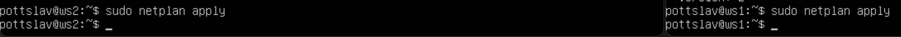
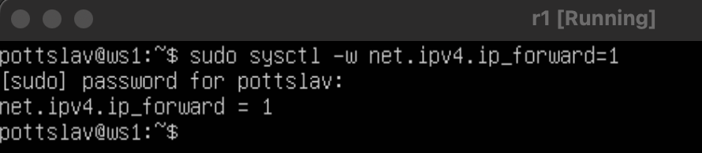
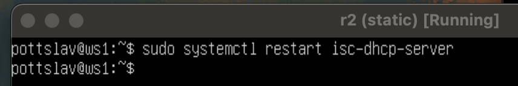

## Part1. Ipcalc

### 1.1 Cети и маски
1. Адрес сети 192.167.38.54/13
- 192.160.0.0

 2. Перевод маски 255.255.255.0 в префиксную и двоичную запись, /15 в обычную и двоичную, 11111111.11111111.11111111.11110000 в обычную и префиксную 
    - 255.255.255.0 в префиксной: /24 

    - 255.255.255.0 в двоичной: 11111111.11111111.11111111.00000000
    
    - /15 в обычной: 255.254.0.0
    - /15 в двоичной: 11111111.11111110.00000000.00000000
    
    - 11111111.11111111.11111111.11110000 в обычной: 255.255.255.240
    - 11111111.11111111.11111111.11110000 в префиксной: /28  (нашли сосчитав кол-во единиц)
    

 3. Минимальный и максимальный хост в сети 12.167.38.4 при масках: /8, 11111111.11111111.00000000.00000000, 255.255.254.0 и /4 

    
    

### 1.2. localhost

- 194.34.23.100 - нет
- 127.0.0.2 - да
- 127.1.0.1 - да
- 128.0.0.1 - нет

Потому что адрес локалхоста начинается со 127 и имеет маску /8, из-за чего мы не можем использовать адреса с началом отличным от 127

### 1.3 Диапазоны и сегменты сетей
1. Какие из перечисленных IP можно использовать в качестве публичного, а какие только в качестве частных

Зная, что для частных сетей выделены диапазоны:

- 10.0.0.0/8 — от 10.0.0.0 до 10.255.255.255
- 172.16.0.0/12 — от 172.16.0.0 до 172.31.255.255
- 192.168.0.0/16 — от 192.168.0.0 до 192.168.255.255

определим, как можно использовать данные ip
    - 10.0.0.45 - частный
    - 134.43.0.2 - публичный
    - 192.168.4.2 - частный
    - 172.20.250.4 - частный
    - 172.0.2.1 - публичный
    - 192.172.0.1 - публичный
    - 172.68.0.2 - публичный
    - 172.16.255.255 - частный
    - 10.10.10.10 - частный
    - 192.169.168.1 - публичный
2. Чтобы можно было использовать адрес,он должен находится между hostmin и hostmax, то есть внутри сети с соответствующей маской.

- 10.0.0.1 - НЕТ
- 10.10.0.2 - возможен
- 10.10.10.10 - возможен
- 10.10.100.1 - НЕТ
- 10.10.1.255 - возможен

## Part 2. Статическая маршрутизация между двумя машинами

 Вывод ip a

 Отредактировав /etc/netplan/00-installer-config.yaml задал соотвествующие адреса

Вывод netplan apply

2.1 Воспользовавшись командой ip r add [IP] dev enp0s3 добавим соединим машины и пропингуем их ip адреса

2.2 Впишем адреса машин в конфигурационные файлы

и пропингуем

## Part 3. Утилита iperf3

### 3.1. Скорость соединения 

8 бит в секунду = 1 байт в секунду

- 8 Mbps = 1 MB/s
- 100 MB/s = 819200 Kbps
- 1 Gbps = 1024 Mbps

### 3.2. Утилита iperf3
Скорость соединения между машинами

## Part 4. Великий китайский файерволл

### iptables
Содержимое файла firewall.sh на каждой машине

Запуск файлов

Запрещающее правило подавляет разрешающее, так как имеет больший приоритет, если стоит перед разрешающим

### nmap
Пинг машины с разрешенным echo reply

Пинг машины с запрешенным портом и проверка через nmap,что она активна

## Part 5. Статическая маршрутизация сети
### 5.1. Настройка адресов машин
Добавляем еще один адаптер для роутеров в настройках VBox
#### r1

#### r2

#### w11

#### w21

#### w22

Пингуем w22 с w21

Пингуем r1 с w11

### 5.2. Включение переадресации
r2

r1

Изменение конфигов

r2

r1

### 5.3. Установка маршрута по-умолчанию

ws11 ws21 ws22

Вызов ip r на ws11 ws21 ws22

Пропинговали r2  c w11

### 5.4. Добавление статических маршрутов

Конфиги r1 и r2

ip r на r1 и r2

Вызов команд на ws11

При наличии несколких маршрутов одинаковой длины выбирается тот, который задан наиболее точно. Поэтому для адреса 10.10.0.0/18 был выбран маршрут, отличный от выбранного для 0.0.0.0/0

### 5.5. Построение списка маршрутизаторов

Вывод traceroute и tcpdump

Для определения промежуточных маршрутизаторов traceroute отправляет целевому узлу серию ICMP-пакетов (по умолчанию 3 пакета), с каждым шагом увеличивая значение поля TTL («время жизни») на 1. Это поле обычно указывает максимальное количество маршрутизаторов, которое может быть пройдено пакетом. Первая серия пакетов отправляется с TTL, равным 1, и поэтому первый же маршрутизатор возвращает обратно ICMP-сообщение «time exceeded in transit», указывающее на невозможность доставки данных. Traceroute фиксирует адрес маршрутизатора, а также время между отправкой пакета и получением ответа (эти сведения выводятся на монитор компьютера). Затем traceroute повторяет отправку серии пакетов, но уже с TTL, равным 2, что заставляет первый маршрутизатор уменьшить TTL пакетов на единицу и направить их ко второму маршрутизатору. Второй маршрутизатор, получив пакеты с TTL=1, так же возвращает «time exceeded in transit».
Процесс повторяется до тех пор, пока пакет не достигнет целевого узла

### 5.6. Использование протокола ICMP при маршрутизации

Пинг несущестующего ip и tcp дамп с роутера

## Part 6. Динамическая настройка IP с помощью DHCP
1) Файл dhcpd.conf

2) Файл resolv.conf

Рестарт dhcp server

Посмотрели ip и пропинговали

Добавили МАС-адрес в ws1

Измененный dhcpd

Изменили resolv.conf и перезапустили dhcp

Освобождаем старый адрес и смотрим ip a

Получаем новый адрес и смотрим ip a

Команда sudo dhclient -r enp0s8 освобождает адрес интерфейса enp0s3. Команда sudo dhclient enp0s8 задает новый адрес указанному интерфейсу.

## Part 7. NAT

Изменили ports.conf на r1

Изменили ports.conf на w22

Перезапустили веб-сервер

Выставили файерволл и запустили, предварительно разрешив выполнение

w22 больше не пингуется с r1

Добавляем разрешение на маршрутизацию всех пакетов протокола ICMP

И перезапускаем файервол

Теперь w22 пингуется

Новый файерволл на r2

Запустили, предварительно разрешив выполнение

Проверил соединение по TCP для SNAT, для этого с ws22 подключился к серверу Apache на r1

Проверил соединение по TCP для DNAT, для этого с r1 подключился к серверу Apache на ws22

