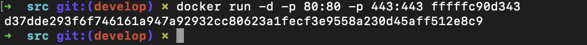

## Part1. Готовый докер
##### Возьми официальный докер-образ с **nginx** и выкачай его при помощи `docker pull`.
##### Проверь наличие докер-образа через `docker images`.
##### Запусти докер-образ через `docker run -d [image_id|repository]`.
##### Проверь, что образ запустился через `docker ps`.
##### Посмотри информацию о контейнере через `docker inspect [container_id|container_name]`.

Размер, адреса, порты

##### Останови докер образ через `docker stop [container_id|container_name]`.
##### Проверь, что образ остановился через `docker ps`.

##### Запусти докер с портами 80 и 443 в контейнере, замапленными на такие же порты на локальной машине, через команду *run*.

##### Проверь, что в браузере по адресу *localhost:80* доступна стартовая страница **nginx**.

##### Перезапусти докер контейнер через `docker restart [container_id|container_name]`.
##### Проверь любым способом, что контейнер запустился.

## Part 2. Операции с контейнером
##### Прочитай конфигурационный файл *nginx.conf* внутри докер контейнера через команду *exec*.

##### Создай на локальной машине файл *nginx.conf*.
##### Настрой в нем по пути */status* отдачу страницы статуса сервера **nginx**.
##### Скопируй созданный файл *nginx.conf* внутрь докер-образа через команду `docker cp`.
##### Перезапусти **nginx** внутри докер-образа через команду *exec*.
##### Проверь, что по адресу *localhost:80/status* отдается страничка со статусом сервера **nginx**.

##### Экспортируй контейнер в файл *container.tar* через команду *export*.
##### Останови контейнер.

##### Удали образ через `docker rmi [image_id|repository]`, не удаляя перед этим контейнеры.
##### Удали остановленный контейнер.

##### Импортируй контейнер обратно через команду *import*.
##### Запусти импортированный контейнер.

##### Проверь, что по адресу *localhost:80/status* отдается страничка со статусом сервера **nginx**.

