## Part 1. Настройка gitlab-runner
Сначала нужно поднять виртуальную машину, а затем, подключив репозиторий gitlab, скачать оттуда gitlab-runner

```curl -L "https://packages.gitlab.com/install/repositories/runner/gitlab-runner/script.deb.sh" | sudo bash```

```sudo apt-get install gitlab-runner```

C помощью команды `sudo gitlab-runner register` регистрируем ранней используя школьный токен. 

Конфиг раннера такой

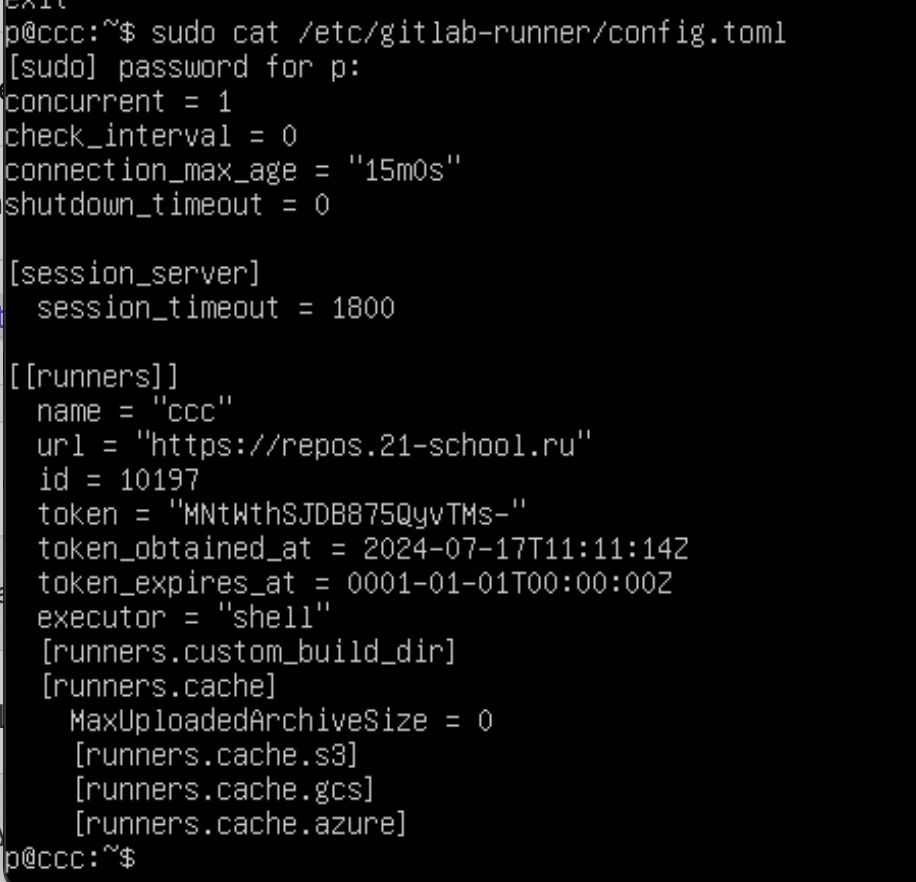

## Part2. Сборка

В yaml файле описывается сборка, запуск Makefile для програм. Для успешной сборки нужно предварительно установить на машину с раннером зависимости в виде gcc и make

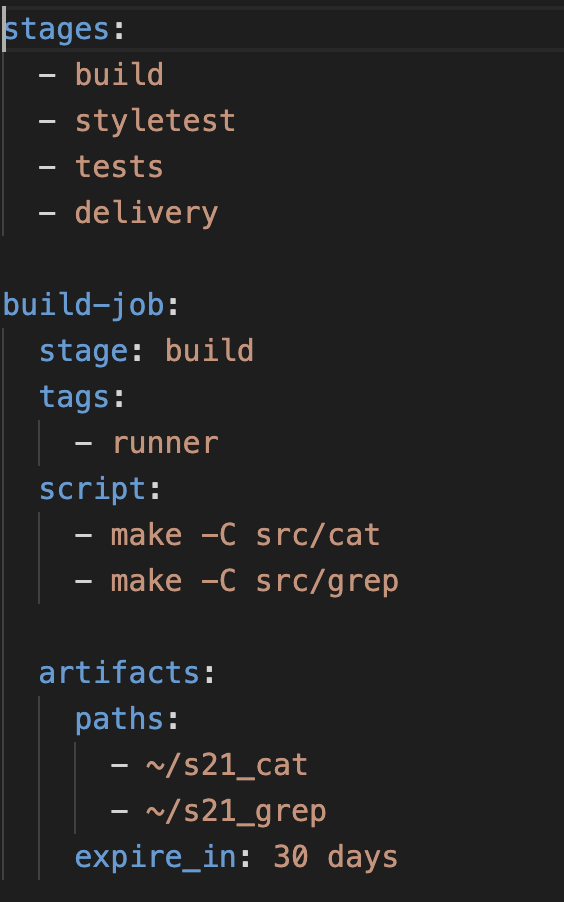

После этого запускается пайплайн с этой стадией

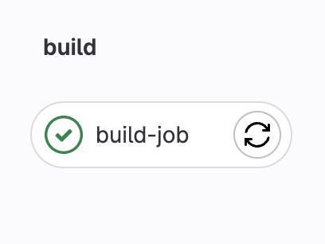

## Part3. Тест кодстайла

Описывается стадия проверки стиля

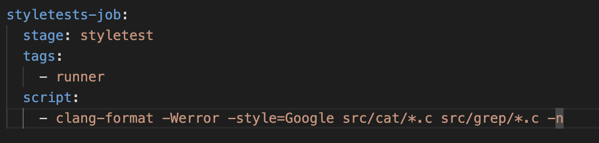

Успешно пройденный стиль

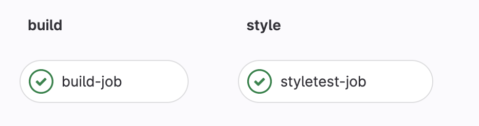

Заваленный стиль

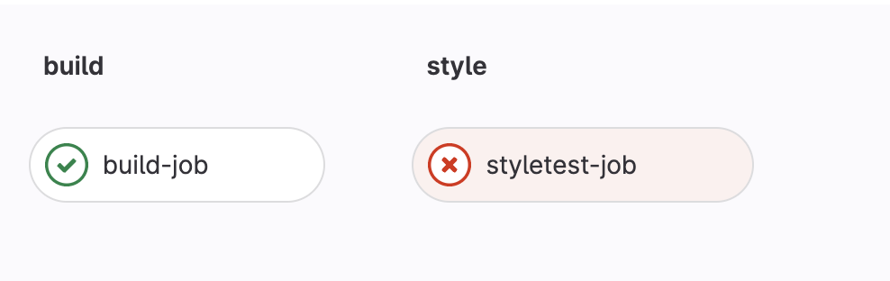

## Part4. Тесты

Описание тестов в yaml

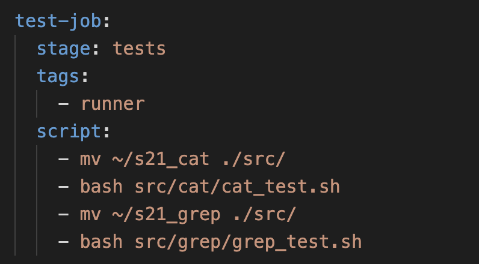

и их выполнение

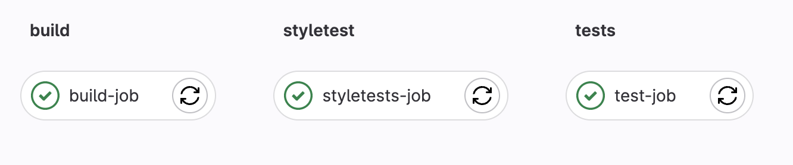

## Part 5. Деплой

Для того, чтобы по ssh перенести файлы, сначала надо соединить виртуальные машины, прописав для них адреса

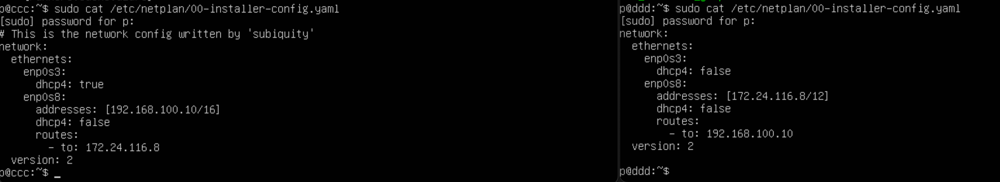

Далее необходимо добавить пользователся gitlab-runner  в sudoers, чтобы он мог переносить файлы по ssh на другую машину командой scp

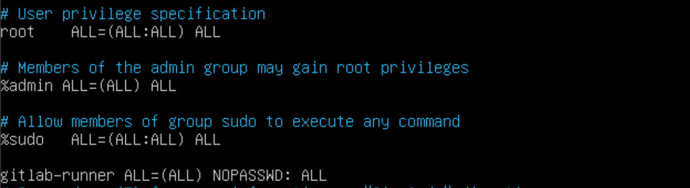

После запуска пайплайна на вторую машину перенесутся скомпилированные файлы

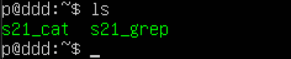

## Part 6. Бот

Используя бота getmyid_bot узанем свой id, чтобы доступ к нему был только у владельца.
Далее в botfather создлает бота

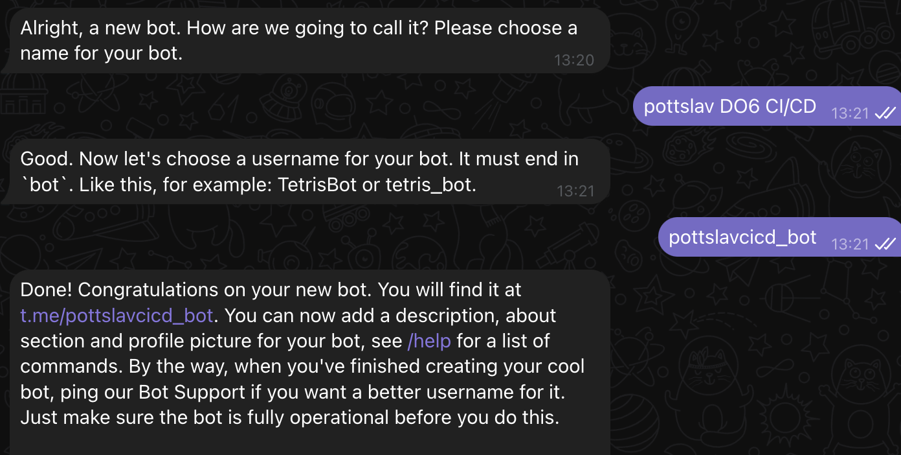

После запуска пайплайна получаем  уведомления

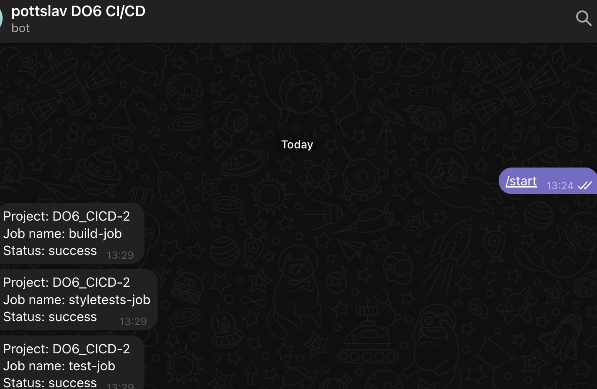